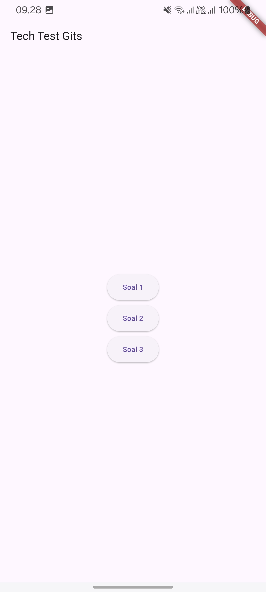
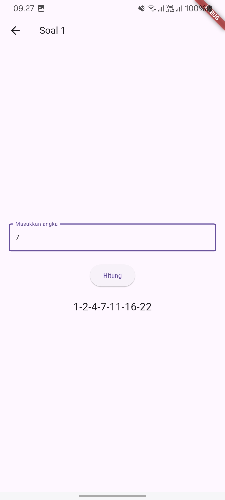
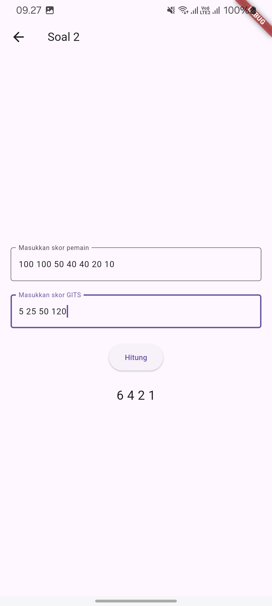
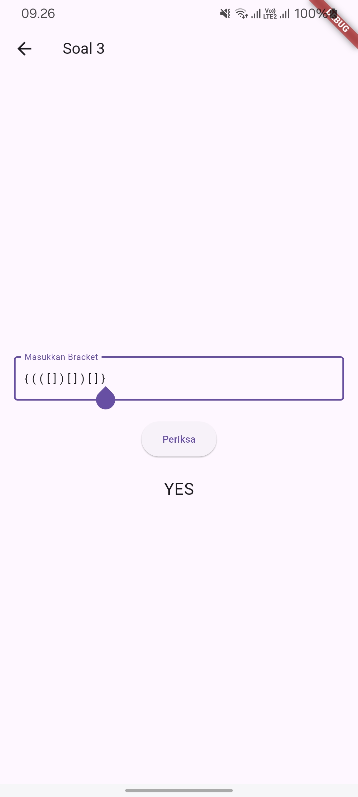

# Hasil Screenshot

  
  

  
  

# Soal 3

Ini adalah solusi untuk soal nomor 3. Tugasnya adalah memeriksa apakah tanda kurung yang dimasukkan seimbang atau tidak. Jika seimbang, output "YES", kalau tidak, output "NO".

## Penjelasan Singkat

- **Input**: String yang berisi tanda kurung seperti `{ [ ( ) ] }` atau `{ ( ] ) }`.
- **Output**: "YES" jika tanda kurungnya seimbang, atau "NO" jika tidak seimbang.

Brackets yang digunakan hanya `()`, `{}`, dan `[]`. Yang perlu dicek adalah apakah setiap tanda buka memiliki pasangan tutup yang sesuai, dan urutannya juga harus benar.

## Kompleksitas

- **Kompleksitas Waktu**: O(n), karena hanya perlu melintasi string sekali dan operasi pada stack memiliki kompleksitas O(1) untuk setiap karakter.
- **Kompleksitas Ruang**: O(n), karena stack digunakan untuk menyimpan tanda buka yang belum ditutup, dan dalam kasus terburuk, stack bisa menyimpan sampai n/2 elemen.
